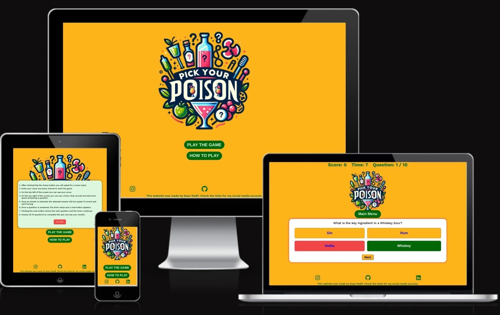

# Pick your poison

The deployed site: [Pick your poison](https://redifo.github.io/pick-your-poison/)

Pick your poison, cocktails learning quiz game website. 
Welcome to "Pick Your Poison," an engaging cocktail learning quiz game designed to elevate your mixology knowledge while having fun! This interactive web application combines the thrill of a quiz game with the sophistication of cocktail culture, making learning both enjoyable and informative.

## CONTENTS

* [User Experience](#user-experience-ux)
  * [User Stories](#user-stories)

* [Design](#design)
  * [Colour Scheme](#colour-scheme)
  * [Typography](#typography)
  * [Imagery](#imagery)
  * [Wireframes](#wireframes)
  * [Features](#features)
    * [The Home Page](#the-home-page)
    * [The Categories Page](#the-game-page)
    * [The Contact Page](#future-implementations)
  * [Accessibility](#accessibility)

* [Technologies Used](#technologies-used)
  * [Languages Used](#languages-used)
  * [Frameworks, Libraries & Programs Used](#frameworks-libraries--programs-used)

* [Deployment & Local Development](#deployment--local-development)
  * [Deployment](#deployment)
  * [Local Development](#local-development)

* [Testing](#testing)
  * [Bugs](#Bugs)
  
* [Credits](#credits)
  * [Code Used](#code-used)
  * [Content](#content)
  * [Media](#media)
  * [Acknowledgments](#acknowledgments)

- - -

## User Experience (UX)

### User Stories

#### First Time Visitor Goals
Explore Cocktail Knowledge:

As a first-time visitor, users aim to participate in an online cocktail quiz to enhance their knowledge of cocktails and mixology.
The user desires the flexibility to play the game at any time and from any location.
They expect the website to be responsive, ensuring a seamless experience on various devices.
The user prioritizes easy navigation to explore the quiz effortlessly.

#### Returning Visitor Goals

Returning visitors aim to continuously improve their cocktail knowledge by trying to improve their score and time.

#### Frequent Visitor Goals

Frequent visitors aim to continuously improve their cocktail knowledge by trying to improve their score and time.
- - -

## Design

### Colour Scheme
#fcb41a (Gold):

The gold hue, represented by #fcb41a, is prominently featured in the background such as the body of the page and background color of buttons, providing a warm and inviting aesthetic. 

#024706 (Dark Green):

It serves as the background color for the main menu buttons, score and timer font colors and footer icon and text colors. It complements the gold color, creating a visually pleasing contrast.

#f04646 (Crimson Red):
It is employed in hover and active states, adding a dynamic and energetic flair to interactive elements. This vivid red creates a visually striking effect and draws attention to user actions.

Blue:

A generic blue color is used for the text color of the answer buttons, offering a clear and readable contrast against the background.

#a9daf7 (Light Blue):

Light blue, denoted by #a9daf7, is utilized in hover states to create a subtle and pleasing transition effect.

White:

White serves as the background color for the questions container, rules window and username inquiry containers ensuring a clean and minimalist backdrop. It promotes readability and maintains a modern and fresh appearance.

This carefully chosen color scheme aims to create a visually harmonious and user-friendly environment. The combination of warm gold, deep green, and vibrant red, along with strategic use of blue and light blue, contributes to a balanced and aesthetically pleasing design. Overall these colors reflects the website's theme: colorful world of cocktails.

  

### Typography

Google Fonts was used to import the chosen fonts for use in the site.

* For the entire website I have used the google font Work sans. Work Sans provides a modern and clean aesthetic with its sans-serif style. Sans-serif fonts are often chosen for their contemporary look and improved readability on digital screens. 

### Imagery

The imagery was designed to highlight the name of the website through a vibrant color scheme by Dall-e 3 using the following prompts:

* Create a logo for a cocktails quiz game site called pick your poison with vibrant colors.

### Wireframes

Wireframes were created for mobile using balsamiq. For other devices wireframes were not seen as a necessity.

### Features
#### Website Structure

The website is comprised of a home page and a Game page.

All Pages on the website are responsive and include:

* A favicon in the browser tab.

* The logo of the website at the center of every page. The logo also acts as a link back to the home page.

* The footer appears at the bottom of every page. Social media icons in the footer connect users with the developer's Instagram, GitHub, and LinkedIn profiles.

#### The Home Page

The main page features a hero logo and prominent buttons to play the game and access instructions on how to play.

Upon clicking "Play the Game" users are directed to the game page where they need to fill in the name field before starting the game. The name field cannot be left blank or cannot be shorter than 4 characters.

Upon clicking "How to play" users are shown the instructions to the game page (Clear rules are provided to guide users on answering questions, displaying scores, and navigating the quiz.) on a popup window with a close button at the bottom. 

#### The Game Page
The game page includes a header displaying the player's score and timer.
A central container presents questions and answer options.
Interactive controls such as "Next" and "Play Again" buttons facilitate smooth progression through the quiz.

#### Future Implementations

In future implementations I would like to:

1. Add high scores page, can be implemented by using a cloud based database to store the player data. Seeing your score against other players would make the game more fun.

2. Add new game mode. The game mode would show the photo and the name of the cocktail and would require the user to select the right ingredients from a pool of options. Could better train cocktail enthusiasts.

### Accessibility

I have been mindful during coding to ensure that the website is as accessible friendly as possible. This has been have achieved by:

* Giving all buttons a hover state to enhance the user experience by making the navigation elements responsive, ensuring that users are aware of clickable elements and encouraging engagement with the website's content.
* Choosing a sans serif font for the website - sans serif fonts are known by their easy readability.
* Making sure that there is sufficient colour contrast.

- - -

## Technologies Used

### Languages Used

HTML, CSS, js

### Frameworks, Libraries & Programs Used

* [Balsamiq](https://balsamiq.com/) - Used to create wireframes.

* [Bing.com Dall-e](https://www.bing.com/images/create/?ref=hn) - Used to create all the images within the website.

* [Git](https://git-scm.com/) - For version control.

* [Github](https://github.com/) - To save and store the files for the website.

* [Google Fonts](https://fonts.google.com/) - To import the fonts used on the website.

* [Google Developer Tools](https://developers.google.com/web/tools) - To troubleshoot and test features, solve issues with responsiveness and styling.

* [Favicon.io](https://favicon.io/) To create favicon from the logo created by Dall-e 3.

* [Am I Responsive](https://ui.dev/amiresponsive) To create a mockup of the website image on different platforms/devices.
  
* [convertio.co](https://convertio.co) To covert images into webp format.

* [Webpage Spell-Check](https://chrome.google.com/webstore/detail/webpage-spell-check/mgdhaoimpabdhmacaclbbjddhngchjik/related) - a google chrome extension that allows you to spell check your webpage. Used to check the site and the readme for spelling errors.

* [sweetalert2](https://sweetalert2.github.io/) Used to display the warning when clicked on the main menu during game.

- - -

## Deployment & Local Development

The site is deployed using GitHub Pages: [Pick your poison](https://redifo.github.io/pick-your-poison/)
To Deploy the site using GitHub Pages follow these steps:

1. Log in or sign up on GitHub.
2. Navigate to the project repository at [redifo/pick-your-poison]([https://github.com/redifo/pick-your-poison)
3. Click on the "Settings" button.
4. Choose "Pages" from the left-hand menu.
5. In the source dropdown, select the main branch and click "Save."
6. Your site is now deployed, but please note that it might take a few minutes before it becomes live.

### Local Development

#### How to Fork

To fork the repository:

1. Log in or sign up on GitHub.
2. Visit the project repository at  [redifo/pick-your-poison](https://github.com/redifo/pick-your-poison)
3. Click the "Fork" button in the top right corner.

#### How to Clone

To clone the repository:

1. Log in or sign up on GitHub.
2. Go to the project repository at [redifo/pick-your-poison](https://github.com/redifo/pick-your-poison)
3. Click on the "Code" button, choose whether to clone with HTTPS, SSH, or GitHub CLI, and copy the provided link.
4. Open the terminal in your code editor, navigate to the desired location for the cloned directory.
5. Type 'git clone' in the terminal and paste the link from step 3. Press enter.

## Testing

Please refer to [TEST.md](TEST.md) file for all testing carried out.

### Bugs 

The main menu button was changing location when tried to be clicked, i could not locate the exact problem but after deleting and rewriting the css for the main menu button the problem resolved.

## Credits

### Code Used

* The structure for the code was inspired by the youtube tutorials listed below: 
[Build A Quiz App With JavaScript](https://www.youtube.com/watch?v=riDzcEQbX6k)
[How To Make Quiz App Using JavaScript | Build Quiz App With HTML CSS & JavaScript](https://www.youtube.com/watch?v=PBcqGxrr9g8)

### Content

All quiz questions content for the site,  were written by me and chatGPT (3.5). 

Readme.md and Testing.md write structure was written by using my past project as a reference (milestone project 1).

### Media
The logo was generated by using Dall-e 3.

### Acknowledgments

I would like to acknowledge the following people:

* My girlfriend Ege Tek for her support.

* My code institute mentor Jubril.
