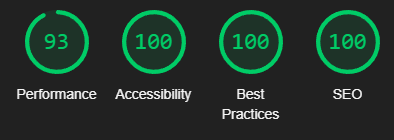

# Pick Your Poison -  Testing

Deployed website: [Pick Your Poison](https://redifo.github.io/pick-your-poison/)

- - -

## CONTENTS

* [AUTOMATED TESTING](#automated-testing)
  * [W3C Validator](#w3c-validator)
  * [Jshint](#jshint)
  * [Lighthouse](#lighthouse)
    * [Desktop Results](#Desktop-Results)
    * [Mobile Results](#Mobile-Results)
* [MANUAL TESTING](#manual-testing)

Continuously test throughout construction. Use Chrome developer tools to find and fix issues as you build. Be proactive in addressing challenges.

During development, rely on Google developer tools. Verify components are working. Use the console to check JavaScript and fix issues.
Check each page for responsiveness. Ensure a seamless user experience on various devices. Adapt to the multi-device landscape.
- - -

## AUTOMATED TESTING

### W3C Validator

The w3 html and jigsaw css validators have been used to make sure the code does not contain any errors. The results shown below are the results of the final tests. During the development of the code this validator has been used multiple times but the results were not recorded before the testing file was created. There was only 2 warnings and they have been fixed before the testing file was created.

 * [W3C](https://validator.w3.org/) 
  
   

     

  

- - -
### Jshint

The home.js file testing shows 3 unsused variables but these variables are the functions and they are only called within the buttons on the home page, therefore it is normal to get these messages. 

 

The automated testing for the game.js file shows 1 undefined variable and 1 unused variable.  The undefined variable is the swal variable which is used for sweetalert2 and the unused variable is the function for preventing accidental home clicking and it is only called within the buttons on the game page, therefore it is normal to get these messages. 

 

### Lighthouse

The website has been tested by google chrome's lighthouse report and the results are shown below. 

#### Desktop Results

home page

Game page

#### Mobile Results

home page

 

Game page

 

- - -

## MANUAL TESTING

Full testing was performed on the following devices:

* pixel 7
* Ipad pro
* windows pc 1080p

Each device tested the site using the following browsers:

* Google Chrome
* Microsoft Edge

`Home page`

| Feature | Expected Outcome | Testing Performed | Result | Pass/Fail |
| --- | --- | --- | --- | --- |
| The Sites title | Link directs the user back to the home page | Clicked title | direct to home page | pass |
| All buttons and navigation menu items and social media icons- hover effect | Change colour when hovered on | Hover over each button on the page | Each button displayed the correct styling when hovered over | pass |
| Game Rules Display | Show the game rules when the "Rules" button is clicked | Clicked the "Rules" button | Game rules displayed | Pass |
| Game Rules Hide | Hide the game rules when the "Close" button is clicked | Clicked the "Close" button | Game rules hidden | Pass |
| Start/Play Game Button | Redirects to the game page | Clicked the "Start Game" button | Redirected to the game page | Pass |

`Game Page`

| Feature | Expected Outcome | Testing Performed | Result | Pass/Fail |
| --- | --- | --- | --- | --- |
| The Sites title | Link directs the user back to the home page | Clicked title | direct to home page | pass |
| All buttons and navigation menu items and social media icons- hover effect | Change colour when hovered on | Hover over each button on the page | Each button displayed the correct styling when hovered over | pass |
| Player Name Validation | Display an error message if the name is less than 4 characters or empty. |  Entered names of various lengths and clicked start button| Error messages displayed correctly | Pass |
| Question Display | Display the current question and answer choices after shuffling. | Clicked the "Next" button to navigate through questions. | Questions and choices displayed correctly and shuffled | Pass |
| Answer Validation | Highlight correct and incorrect answers, disable further clicks. | Clicked on answer choices for various questions. | Correct answers highlighted, buttons disabled | Pass |
| Next Button Functionality | Increment question index, show the next question, and hide the button if no more questions. | Clicked the "Next" button after answering questions. | Question index incremented, next question displayed | Pass  |
| Reset Button Functionality  | Reset question index, score, and timer, display the first question. | Clicked the "Reset" button after completing the game. | Game reset, first question displayed | Pass |
| Timer Functionality | Start, stop, and reset the timer as expected. | Observed timer behavior during gameplay and resets. | Timer starts, stops, and resets correctly | Pass |
| Game Completion Display | Show the final score, player name, and time after completing the game. | Completed the game by answering all questions. | Final score, player name, and time displayed | Pass |
| Prevent Home Functionality  | Display a confirmation alert before navigating to the home page. | Clicked on the home button during gameplay. | Confirmation alert displayed, navigation prevented | Pass |
| Accidental Click Prevention | Display a confirmation alert before navigating to the home page. | Clicked on the game logo during gameplay. | Confirmation alert displayed, navigation prevented | Pass |

